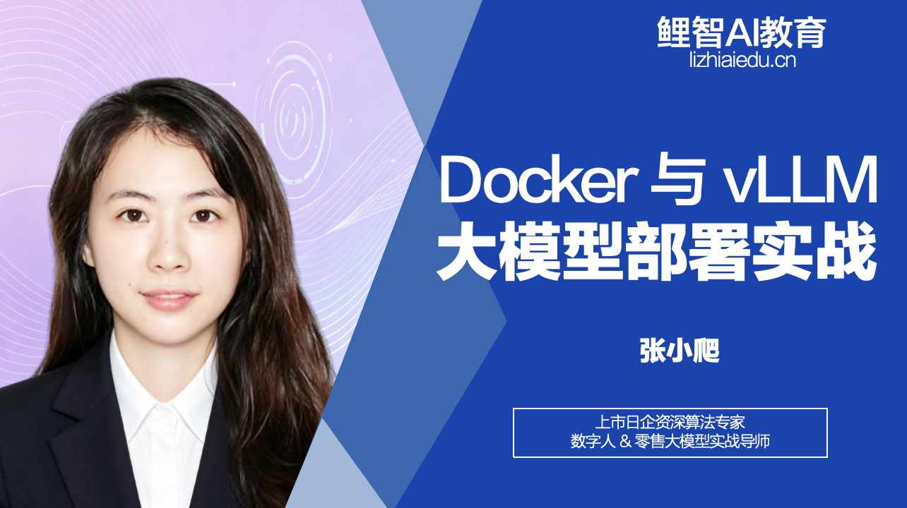
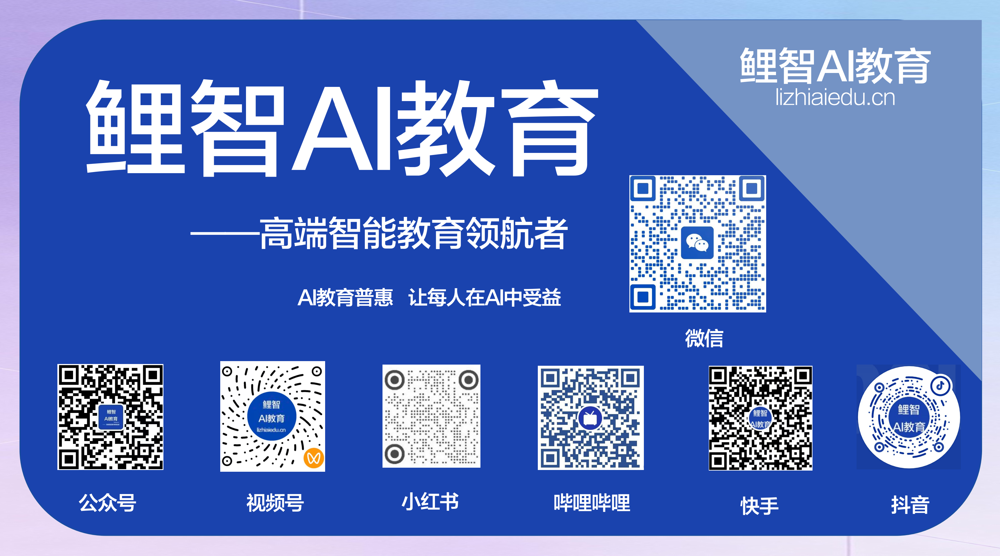

# 「鲤智AI教育公开课」 
## docker\-vllm 开源教育项目介绍
## docker\-vllm 🚀｜Docker 从入门到 vLLM 大模型容器化部署实战讲义

**出品方：鲤智AI教育 🐟｜专注AI全栈、云原生、容器化实战教学**

**MIT License · 完全开源免费 · 零基础可学 · 原理\+实战双覆盖**

本仓库由**鲤智AI教育**开源出品，是一站式 Docker \+ vLLM 云原生大模型实战教程。区别于网上碎片化命令文档，**不止教你敲命令，更讲透底层内核原理**。从容器基础、内核隔离原理，到大模型vLLM容器化GPU部署全覆盖，配套完整随堂习题、可直接复用脚本、Compose编排模板，适合后端开发、AI算法工程师、运维、零基础学习者系统学习容器与大模型推理服务部署。



*课程封面*

---

## 📌 项目亮点

- **零基础友好**：循序渐进教学，从容器痛点、基础概念入手，无前置门槛

- **深挖底层原理**：全网少见的Docker内核三剑客详解 `Namespace` / `Cgroups` / `OverlayFS`，讲清容器本质

- **AI场景落地**：贴合当下大模型生态，完整覆盖vLLM容器化GPU部署，适配NVIDIA显卡

- **核心技术拆解**：图解PagedAttention分页KV缓存、连续批处理核心原理，看懂vLLM高性能底层逻辑

- **开箱即用代码**：一键运行docker run命令、完整docker\-compose编排文件、模型本地挂载脚本

- **配套随堂测验**：每章节附带选择\+简答习题\+标准答案，学完即可自测巩固

- **可复用生产模板**：内存限制、共享内存调优、显存配比、GPU透传生产级参数直接照搬

---

## 📚 仓库内容目录

1. **Docker基础入门**：容器vs虚拟机、镜像/容器/仓库核心概念

2. **常用命令实操**：镜像、容器、日志、端口调试高频命令全覆盖

3. **Dockerfile最佳实践**：分层缓存原理、多阶段构建、镜像瘦身方案

4. **Docker Compose编排**：多容器一键启停、服务依赖、资源限制配置

5. **容器底层内核原理（重难点）**：六大命名空间、资源限制、分层存储、OCI运行时架构

6. **vLLM大模型容器化部署**：NVIDIA GPU透传、本地模型挂载、离线部署方案

7. **vLLM核心原理精讲**：PagedAttention、连续批处理、显存碎片优化

8. **服务调试与问题排查**：OOM显存溢出、共享内存报错、容器GPU识别失败全套解决方案

9. **接口对接实战**：OpenAI兼容接口调用、Python SDK对接完整示例

---

## ⚡ 快速上手（vLLM一键部署）

### 前置环境

- Linux 宿主机 \+ NVIDIA显卡

- 安装Docker \+ NVIDIA Container Toolkit（GPU容器依赖）

### 一键启动vLLM推理服务

```bash
docker run --gpus all \
  --name vllm-qwen3-0_6b \
  --memory=10g --memory-swap=10g \
  --shm-size=8g \
  -p 8000:8000 \
  -v 本地模型目录:/models/Qwen3-0.6B:ro \
  vllm/vllm-openai:latest \
  --model /models/Qwen3-0.6B \
  --gpu-memory-utilization 0.85 \
  --max-model-len 4096
```

### 服务验证

```bash
# 查看可用模型
curl http://localhost:8000/v1/models

# 对话接口测试
curl http://localhost:8000/v1/chat/completions \
  -H "Content-Type: application/json" \
  -d '{"model":"Qwen3-0.6B","messages":[{"role":"user","content":"你好"}]}'
```

---

## 🎯 适合人群

- 想要系统吃透Docker底层原理，不只会敲命令的开发/运维

- 需要容器化部署大模型，缺少生产级部署模板的AI工程师

- 想要弄懂vLLM高性能推理底层原理，而不是只会部署的学习者

- 在校计算机专业学生、云计算与AI方向自学人群

---

## 📄 开源协议

本项目采用 **MIT License**开源协议：

- ✅ 允许所有人自由复制、学习、修改、商用、二次分发

- ✅ 无使用限制，仅要求二次分发时保留原始版权声明

- ✅ 项目持续更新，持续补充大模型容器化实战案例

---

## 🤝 参与共建

欢迎 Star ⭐ 收藏本仓库，同时欢迎提交 Issue 反馈问题、提交 PR 补充案例，一起完善容器\+大模型实战教程。

**Star 轨迹**：⭐⭐⭐

---

## 🐟 关于鲤智AI教育

**定位：AI教育普惠践行者 · 高端智能教育领航者**

立足国家「人工智能\+教育」战略风口，鲤智AI教育始终以**用AI重构学习体验，让优质教育触手可及，助力人人高效成长**为核心使命；以**成为AI教育领域创新标杆，打造个性化学习首选品牌**为发展愿景。坚守**教育普惠、科技向善、因材施教、务实育人**四大核心价值观，依托前沿人工智能技术，深耕智慧教育全赛道。

我们汇聚专业教研团队与技术研发力量，融合前沿AI技术与现代化实战教学理念，打破优质技术教育资源壁垒，降低云原生、大模型工程化等硬核技术学习门槛，打造专业化、体系化、重实操的智慧技术学习生态。业务覆盖青少年AI素养启蒙、职场工程师技能进阶、开发者全栈AI系统学习、企业定制化技术培训四大板块。

本开源项目正是鲤智AI教育普惠计划的重要一环：坚持免费开源、公益技术分享，无门槛开放全套硬核技术讲义与可复用工程代码，让每一位学习者都能零成本吃透容器底层原理、大模型工程化落地实战知识，真正实现**科技向善，教育普惠，让每个人都能在AI时代受益成长**。

---

## 🤝 公益招募｜欢迎加入鲤智开源公益共建团队

鲤智AI长期坚持**免费开源、公益技术共建**，现公开招募团队共建者，携手产出高质量免费技术开源教程，助力广大开发者零基础深耕云原生与大模型工程化落地！

### ✨ 招募方向

- 文档编辑：优化开源讲义、补充实操笔记、整理学习题库

- 技术共建：补充Docker、vLLM、K8s、AI工作流实战案例

- 社区运营：维护开源社区、解答新手常见技术问题

- 内容共创：参与后续免费开源项目策划与内容打磨

### 🎁 团队福利

- 免费获取鲤智AI全部付费课程、全套源码与课件

- 一线技术老师一对一答疑，深度学习云原生\+大模型实战

- 开源项目署名，丰富个人GitHub履历与技术简历

- 志同道合技术圈子，交流学习、内推资源同步共享

**零费用、纯开源、公益共建成长**，热爱技术、愿意深耕开源内容分享即可加入！感兴趣欢迎私信联系，一同坚守开源初心，输出更多免费硬核技术干货💛



